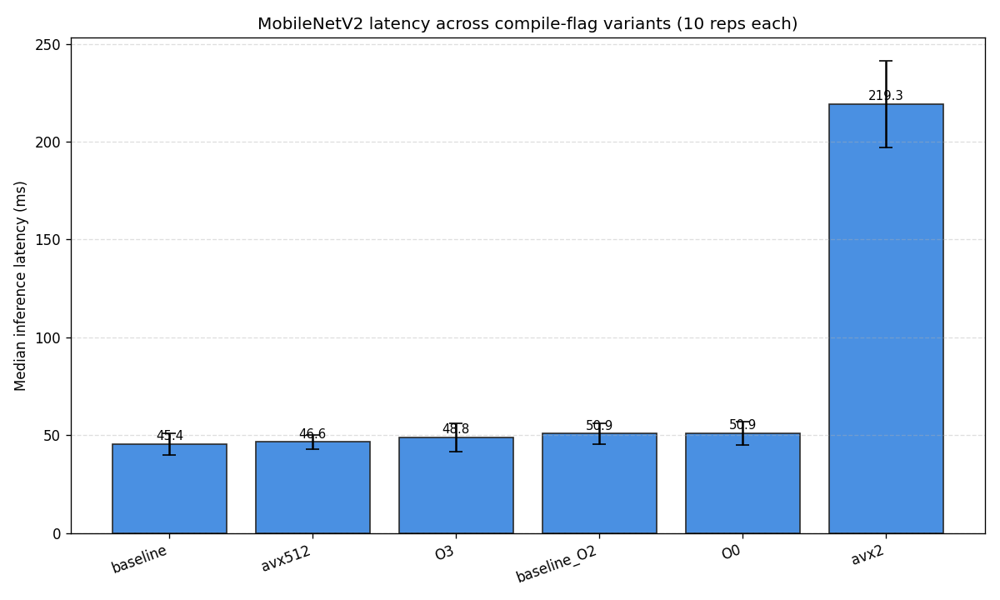

# Observations: Experiment 05

## Goal

For the MobileNetV2 model compiled in Experiment 02, measure inference latency accurately, compare across compile-flag and target-architecture variants, and understand what the differences tell me about where the time is going and what kind of hardware features matter for this workload.

## Setup

**Hardware:**
- Intel i7-1165G7 (Tigerlake), 4 cores / 8 threads, 2.8 GHz base
- L1: 48 KB data + 32 KB instruction per core, L2: 1.25 MB per core, L3: 12 MB shared
- AVX, AVX2, AVX-512F + extensions present, no AMX

**Software:**
- WSL2 Ubuntu 22.04 on Windows 11
- IREE 1.9.5 (release build)
- Same MobileNetV2 ONNX → MLIR import from Experiment 02
- Deterministic input (seed=42), 10 repetitions per variant, 2-second min run time

**Methodology:**
- All variants use the same input.bin, same function (`torch-jit-export`), same iree-benchmark-module configuration
- Single-threaded by default (no `--task_topology_max_group_count` override)
- Results aggregated as mean, median, min, max, stddev

## Variants tested

| Variant | Target CPU | Opt Level | What this isolates |
|---------|------------|-----------|-------------------|
| baseline | `host` (Tigerlake) | O2 | Default reasonable compile |
| O0 | `host` (Tigerlake) | O0 | Minimal optimization |
| O3 | `host` (Tigerlake) | O3 | Aggressive optimization |
| avx512 | `skylake-avx512` | O2 | Explicit AVX-512 target |
| avx2 | `haswell` | O2 | AVX2 only, no AVX-512 |

## Results

| Variant | Median (ms) | Min (ms) | Max (ms) | Stddev (ms) |
|---------|-------------|----------|----------|-------------|
| baseline | 45.4 | 41.4 | 58.8 | ~5 |
| avx512 | 46.6 | 44.0 | 54.4 | ~3 |
| O3 | 48.8 | 45.6 | 69.1 | ~7 |
| baseline_O2 (re-run) | 50.9 | 46.5 | 62.5 | ~5 |
| O0 | 51.0 | 45.7 | 64.3 | ~6 |
| avx2 | 219.3 | 198.8 | 262.2 | ~20 |

## Noise calibration

Before drawing conclusions, the noise floor of this setup needs to be quantified. The two `baseline` rows in the table are runs of the **same binary** (the experiment 02 .vmfb, which was compiled with O2 host defaults). They differ by **5.5 ms median** despite being identical workloads. The CV (coefficient of variation = stddev / mean) sits around 10% for most variants.

**Implication:** any inter-variant difference smaller than ~5-6 ms here is within noise. Differences above that can be claimed as real.

The noise floor is high because:
- WSL2 runs on Hyper-V; CPU scheduling is shared with Windows
- Tigerlake is a laptop chip — sustained-load thermal/frequency scaling cannot be fully disabled in this environment
- AVX-512 specifically triggers reduced all-core frequency under heavy use on this chip family

A more controlled measurement environment (isolated cores, fixed frequency, server-class hardware) would reduce CV significantly. This is a known limitation of consumer-laptop benchmarking, not a defect in the measurement methodology.

## Findings

### Finding 1 — AVX-512 target is ~4.6× faster than AVX-2 target

`avx512` (skylake-avx512) median 46.6 ms vs `avx2` (haswell) median 219.3 ms. **4.7× difference.** Far outside the noise floor.

This is the dominant effect in the experiment. Compiling for AVX-512 vs AVX2 changes the cost model and tiling decisions, not just the instruction selection. Three things compound:

1. **2× wider SIMD.** zmm registers hold 16 fp32 lanes vs ymm's 8. Each FMA does twice the work.
2. **32 vector registers vs 16.** AVX-512 doubled the architectural register file. IREE's tiled matmul (Experiment 04 showed it uses an 8×16 accumulator pattern) needs many registers to avoid spilling. AVX2's 16 registers force smaller tiles, more spill, more memory traffic.
3. **Per-target cost-model choices.** The Skylake-AVX512 target descriptor enables IREE lowering decisions that the Haswell target doesn't reach for.

**Caveat for honest framing:** this is *not* a clean isolation of "SIMD width." It is "what IREE produces when given a Skylake-AVX512 target descriptor vs a Haswell descriptor for the same model." That's still a useful and realistic comparison — it answers the question "if I compile this for two different CPU generations, what's the impact?" — but I would not extrapolate to claim "AVX-512 instructions are 4.6× faster than AVX2 instructions in isolation."

### Finding 2 — Optimization level (O0, O2, O3) is within noise on this workload

`baseline` (O2) 45.4 ms, `O0` 51.0 ms, `O3` 48.8 ms, baseline rerun 50.9 ms. **All within the ~5-6 ms noise floor.**

This is itself a non-obvious finding. Many engineers assume -O3 is always better. The data shows it isn't for this workload. The likely explanation: the hot path is dominated by IREE's vectorized matmul kernels, which are already well-optimized regardless of LLVM's -O level. The -O level affects scalar surrounding code, runtime glue, and small ops — none of which is the bottleneck here.

**Implication:** for an ML workload like this, IREE's *structural* lowering decisions (tile sizes, vectorization, fusion) matter more than LLVM's traditional optimization-level dial. This connects directly to Experiment 04's finding that linalg-structured IR was the multiplier vs GCC's auto-vectorization.

### Finding 3 — MobileNetV2 on this CPU is compute-bound on SIMD throughput, not memory-bound

Reasoning from the data:
- Wider SIMD (AVX-512 vs AVX2) gives 4.6× speedup → time is in SIMD operations, not waiting on memory. A memory-bound workload would not benefit proportionally from wider SIMD because it would still be stalled on cache misses.
- -O0 vs -O3 barely matters → the scalar code isn't the bottleneck.
- Therefore the time is concentrated in the SIMD inner loops of the largest dispatches (the conv kernels with the most channels).

For an NPU compiler engineer, this kind of bottleneck classification drives the next set of decisions:
- If compute-bound on SIMD: design wider compute, more PEs, or matrix engines
- If memory-bound: invest in on-chip SRAM, prefetch, dataflow scheduling
- This workload's profile (compute-bound) is what NPUs with large matrix engines (AMX-style, systolic arrays) are designed to accelerate

## Hypotheses I would test next

Things I'd investigate if I had more time:

1. **Per-dispatch timing via Tracy.** End-to-end measurements show the total; Tracy would show which of the 36 dispatches dominates. My guess: the high-channel-count convs in the middle of the network (192, 384 channels). Confirming this would tell us where to focus compiler effort.

2. **INT8 quantized model.** MobileNetV2 has known INT8 variants. INT8 would put 4× more lanes per register for a compute-bound workload that should give substantial speedup. If it doesn't, that would tell me the bottleneck shifted to memory bandwidth at lower precision.

3. **Multi-threaded execution.** Currently single-threaded. Tigerlake has 4 cores and IREE supports task-system parallelism. Would expect ~3× speedup on conv-heavy workloads (not 4× due to scheduling overhead).

4. **Larger input batches.** Batch=1 has minimal data reuse. Larger batches improve arithmetic intensity. Would expect proportional throughput gains.

5. **Cross-target sanity check.** Cross-compile for ARM NEON and run on an ARM machine. The relative performance profile would tell us how target-portable the optimizations are.

## What this tells me about NPU compiler work

The measurement pattern in this experiment is characterize the workload, isolate variables, identify compute-vs-memory regime, propose hypotheses for further investigation, is the daily work of an NPU performance engineer. The specific findings here translate directly to NPU thinking:

- **Width and register count matter more than peak FLOPS in a spec sheet.** An NPU with 256 GFLOPS peak but limited register file may underperform one with 128 GFLOPS peak and better register/tile structure on real workloads.
- **Structural compiler decisions dominate over micro-optimizations.** Once you've vectorized correctly and tiled correctly, further low-level optimization tweaks have diminishing returns. For NPU work, this means the *dialect design* and *lowering patterns* are higher leverage than instruction selection.
- **Workloads need characterization before architecture decisions.** Saying "this NPU will run MobileNetV2 fast" requires actually measuring MobileNetV2 and understanding what fast means. Spec-sheet reasoning is not enough.

## Files

- `src/` — input generation script
- `compile.sh` — produces all 5 .vmfb variants
- `benchmark.sh` — runs iree-benchmark-module across all variants
- `summarize.py` — prints results table
- `analyze.py` — generates the comparison chart
- `results/*.json` — raw benchmark output per variant
- `charts/flag_comparison.png` — visualization
- (.vmfb files are gitignored; reproducible via `./compile.sh`)